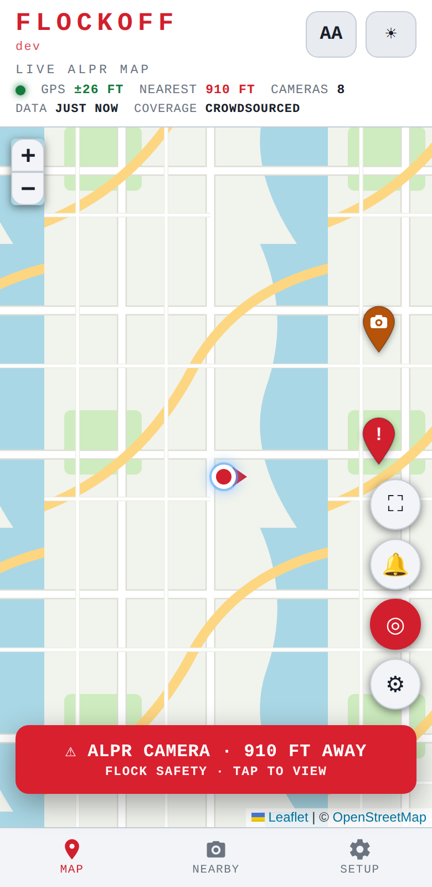
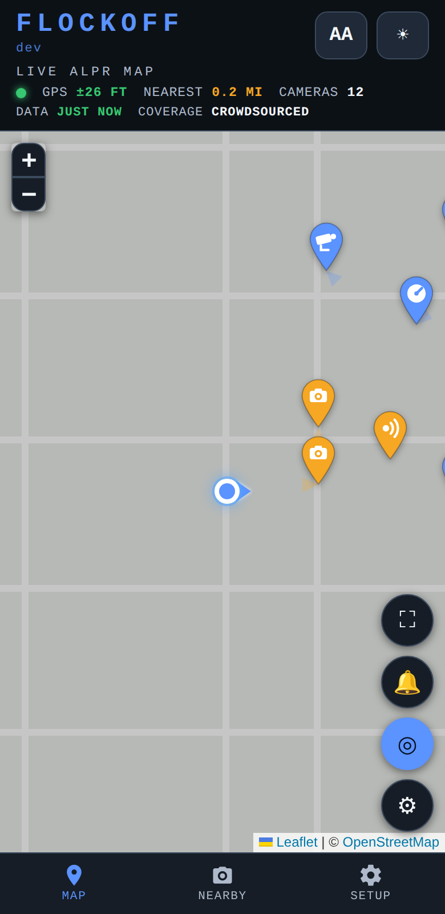
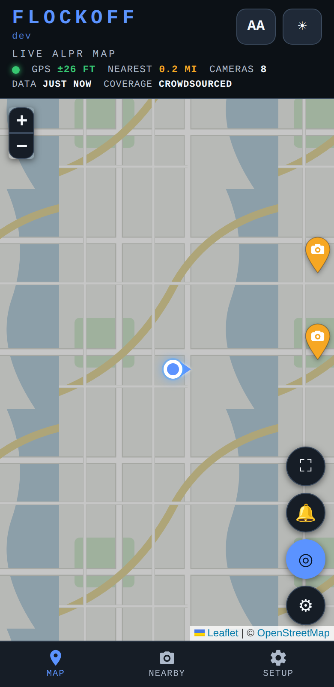

<div align="center">

# 🚨 FlockOff

### **See the cameras that see you.**

*A real-time, driver-facing map of the ALPR surveillance dragnet — license-plate
readers, speed cams, red-light cams, CCTV, and gunshot sensors — with proximity
alerts as you approach them. Built from crowdsourced, public OpenStreetMap data.*

<br>

<a href="https://cdburgess75.github.io/FlockOff/">
  
</a>

**[cdburgess75.github.io/FlockOff](https://cdburgess75.github.io/FlockOff/)**

*No account. No install. No tracking. Open it, tap GO, drive.*

<br>

<!-- HERO VISUAL — currently a simulated-drive screenshot (Liberty theme, alert
     firing). Ideal replacement: a short GIF/screen-recording of a REAL drive on
     a phone — approach a camera, alert card pops, pin pulses red. ~15s loop,
     portrait, <5 MB. Drop it in at docs/screenshots/hero.png (or .gif) and the
     README picks it up. -->


</div>

---

## ⚡ What it does

FlockOff makes the invisible surveillance network **visible to the people driving
through it**. ALPR cameras log where your car is and when, and pool that history
across police departments and private operators — silently, retroactively, at
scale. You should get to know when you're being read.

- 📍 **Live surveillance map** — every mapped detector around you, loaded
  automatically for whatever area you're looking at, cached for offline use.
- 🔔 **Proximity alerts while driving** — audible beep, red alert card,
  vibration, and optional spoken callouts (*"License plate reader ahead,
  900 feet"*) when you close within your alert radius. Debounced per camera so
  nothing chatters.
- 🎯 **Field-of-view cones** — cameras with a mapped facing direction show an
  estimated FOV wedge at driving zoom, so you can see *where they're pointed*.
- 🗂️ **Five detector layers, all user-selectable** — ALPR plate readers and
  acoustic gunshot sensors on by default; speed cameras, red-light/traffic
  cams, and general CCTV opt-in. Distinct pin glyphs for each.
- 🟢 **One-tap drive mode** — the green **GO** button goes full-screen and turns
  on center-tracking in a single tap.
- 📶 **Offline-first PWA** — app shell, map tiles you've seen, and camera data
  all cached on-device. Installable to your home screen; updates arrive with an
  explicit "Update now" banner, never mid-drive.
- 🎨 **13 themes + 8 map styles** — from muted dark to high-visibility, with a
  red/white/blue Freedom set. Big-text accessibility toggle (AA).
- 🤫 **Coverage honesty** — the app tells you when data is stale and reminds
  you that *quiet ≠ clear*. It never pretends an unmapped road is a safe road.
- 🛡️ **Passive by design** — reads public map data and your own GPS, on your
  device. Transmits nothing about you, touches no camera, interferes with no
  signal.

<div align="center">

<!-- FEATURE VISUALS — left: mixed detector pins + FOV cones (dark theme).
     right: the default Graphite look while driving. Replace with real-drive
     captures when available; keep both portrait, ~360 px display width. -->

&nbsp;&nbsp;


</div>

## 🧰 Tech stack


One HTML file. No framework, no bundler, no npm install, no backend. Leaflet is
vendored under `vendor/`, so the whole app is self-contained and auditable in
an afternoon.

## 🚀 Quick start (local)

**Prerequisites:** any modern browser, Python 3 (or any static file server),
and `git`.

```bash
# 1. Clone
git clone https://github.com/cdburgess75/FlockOff.git
cd FlockOff

# 2. Install — nothing. There are no dependencies.

# 3. Run any static server (service worker + geolocation need http://, not file://)
python3 -m http.server 8080

# 4. Open it
#    App:  http://localhost:8080/
#    Demo: http://localhost:8080/demo.html  (simulated drive, no GPS needed)
```

Want to see it work without leaving your desk? **`demo.html`** runs the real
app code against a simulated car driving past mock cameras — alerts, pins, and
status bar all react live. It's regenerated from the app by
`python3 tools/build_demo.py`; `index.html` stays the single source of truth.

**Deploying your own:** it's a static site — host `index.html` + `vendor/` +
`icons/` + `manifest.webmanifest` + `sw.js` anywhere. This repo auto-deploys to
GitHub Pages on every push to `main` via `.github/workflows/pages.yml`
(one-time setup: *Settings → Pages → Source → GitHub Actions*).

## 📱 Install it on your phone ("Save to Home Screen")

FlockOff is a PWA — saved to your home screen it launches full-screen with its
own icon, keeps working offline, and feels like a native app. **This is the
recommended way to use it in a car.**

### iPhone / iPad (Safari)

1. Open **[the live app](https://cdburgess75.github.io/FlockOff/)** in
   **Safari**.
2. Tap the **Share** button (the square with an arrow, bottom of the screen).
3. Scroll down and tap **Add to Home Screen**.
4. Tap **Add**. Done — look for the FlockOff radar icon on your home screen.

> 💡 iPhone tip: the alert beep plays on the **media** channel and is silenced
> by the ring/silent switch. Use **Setup → Test alert now** in your driveway to
> confirm you can hear it before you rely on it.

### Android (Chrome)

1. Open **[the live app](https://cdburgess75.github.io/FlockOff/)** in
   **Chrome**.
2. Tap the **⋮ menu** (top right).
3. Tap **Add to Home screen** (on newer versions: **Install app**).
4. Confirm with **Install** / **Add**. FlockOff appears in your app drawer and
   home screen like any other app.

<!-- INSTALL VISUAL PLACEHOLDER — a side-by-side pair of phone screenshots:
     (1) iOS Safari share sheet with "Add to Home Screen" highlighted,
     (2) Android Chrome menu with "Install app" highlighted. Suggested path:
     docs/screenshots/install-ios.png and docs/screenshots/install-android.png,
     ~300 px display width each. Uncomment when added:

<div align="center">

&nbsp;&nbsp;

</div>
-->

## 🧭 Using it

1. Open the app and tap **"Enable alerts & keep screen on"** — that one tap
   unlocks alert audio and keeps the screen awake in a mount.
2. Hit the green **GO** button — full-screen map, center-tracking on.
3. Drive. Pins go **amber** as you approach and **red** (with a pulsing `!`)
   inside your alert radius; the red card, beep, and vibration fire together.
4. Tune everything in **Setup**: detector layers, alert radius, heading filter,
   voice callouts, units, themes, map styles — and a **Test alert now** button
   so you can verify sound before you need it.

## ⚠️ Coverage honesty — silence is not safety

The dataset is **crowdsourced and incomplete**. An empty road does **not** mean
no cameras — unmapped installs and mobile trailer units won't appear, and
mapped points can be stale. FlockOff surfaces data freshness in the status bar
and reminds you in-app: **no beep does not mean no camera.**

The fix is more mappers. If you can see which way a camera points, adding its
`direction` tag on [OpenStreetMap](https://www.openstreetmap.org) (see
[DeFlock's guide](https://deflock.me)) gives *everyone* its field-of-view cone.

## 🔒 What it is — and isn't

- ✅ **Passive.** Reads public map data + your own device GPS, on your device.
- ✅ **Private.** No account, no server of ours, no telemetry, nothing
  transmitted about you — your location never leaves your phone.
- ❌ **Not a router.** It never plans camera-avoiding routes; it informs, you drive.
- ❌ **Not interference.** It touches no camera, jams no signal.

Because per-category alerting (speed / red-light) is a user's own choice, the
alerting build ships as a **web app / PWA** rather than through the app stores.
The reasoning behind every major design decision lives in
[`docs/DIRECTION.md`](docs/DIRECTION.md).

## 🗺️ Data credits

Camera data © [OpenStreetMap](https://www.openstreetmap.org/copyright)
contributors (ODbL), via the Overpass API, using the
[DeFlock](https://deflock.me) tagging scheme. Map tiles © OpenStreetMap
contributors, [CARTO](https://carto.com/attributions), Esri, and Stadia Maps.

---

<div align="center">

**Made for people who think being tracked everywhere they drive is worth knowing about.**

<a href="https://cdburgess75.github.io/FlockOff/">
  
</a>

</div>
